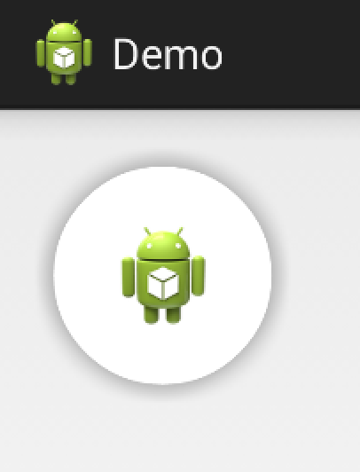
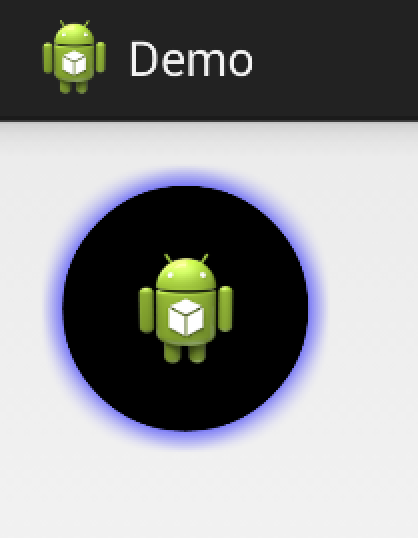

CircularButton
==============

Circular button for Android.

This library provides a circular button that looks like the new button shown in the Google+ app for Android.



## Usage
You can delcare a `CircularButton` just like that:

```XML
    <me.alexrs.circularbutton.lib.CircularButton
        android:id="@+id/button"
        android:layout_width="wrap_content"
        android:layout_height="wrap_content"
        android:src="@drawable/ic_launcher"
        app:buttonColor="color"
        app:shadowColor="color"
 />
```

By default, the button color is white and the shadow color is grey.

Also, you can set the button color and the shadow color with Java

```JAVA
CircularButton button = (CircularButton) findViewById(R.id.button);
```

- Button color

```JAVA
button.setButtonColor(Color.BLACK);
```
- Shadow color

```JAVA
button.setShadowColor(Color.BLUE);
```




License
-------
    Copyright 2014 Alexrs95.

    Licensed under the Apache License, Version 2.0 (the "License");
    you may not use this file except in compliance with the License.
    You may obtain a copy of the License at

       http://www.apache.org/licenses/LICENSE-2.0

    Unless required by applicable law or agreed to in writing, software
    distributed under the License is distributed on an "AS IS" BASIS,
    WITHOUT WARRANTIES OR CONDITIONS OF ANY KIND, either express or implied.
    See the License for the specific language governing permissions and
    limitations under the License.